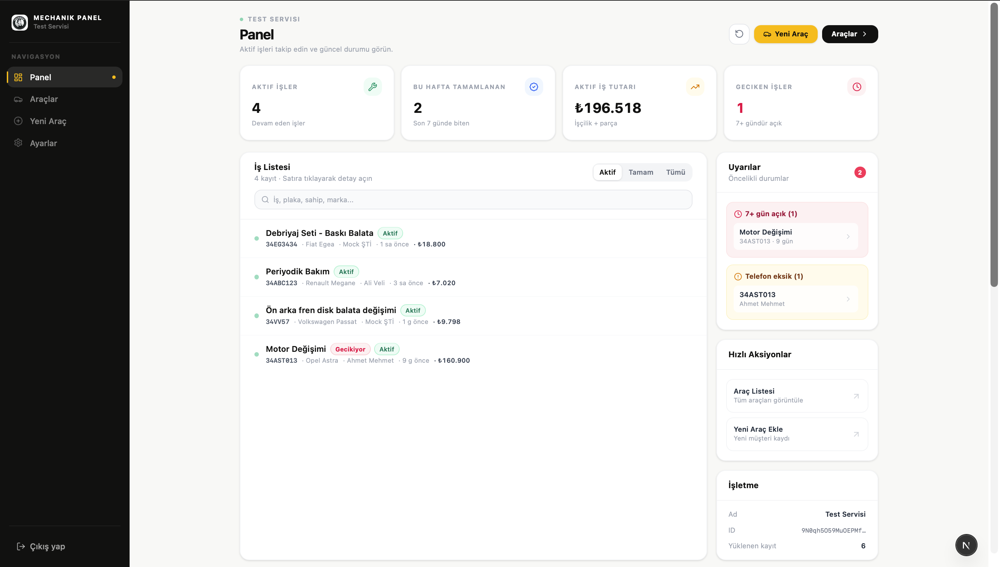
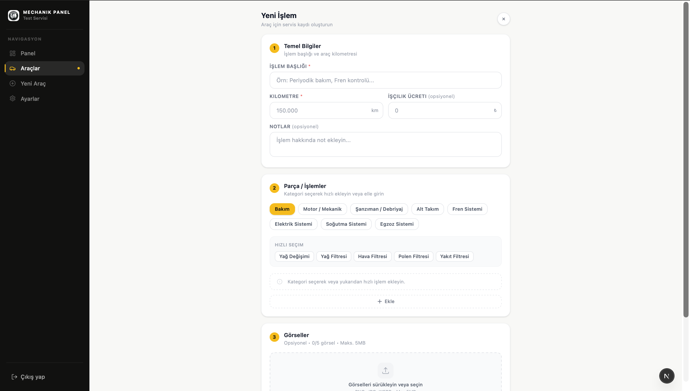
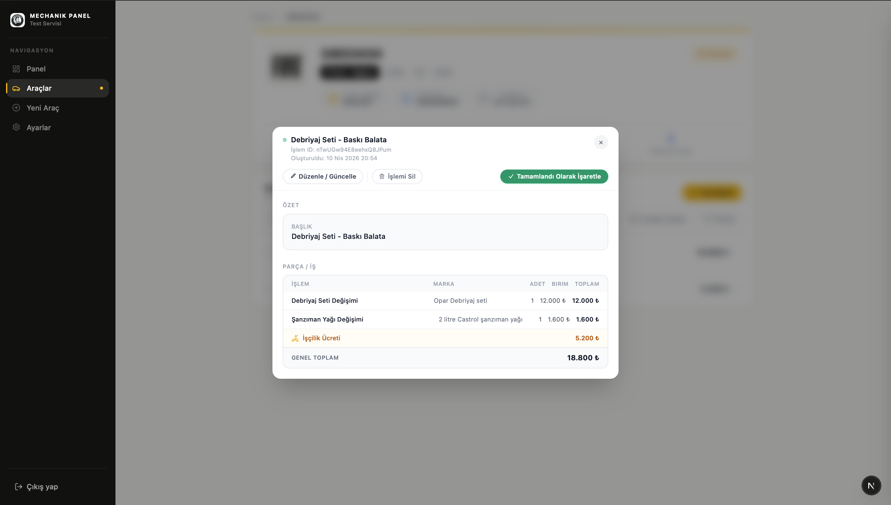
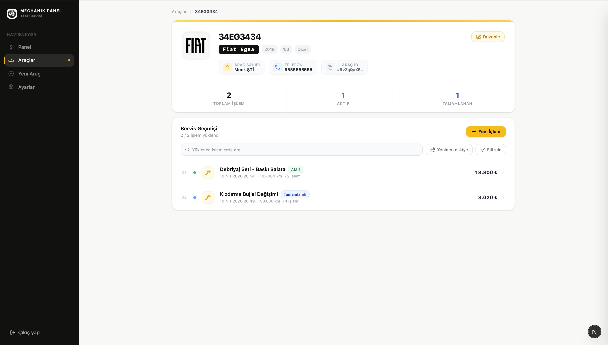
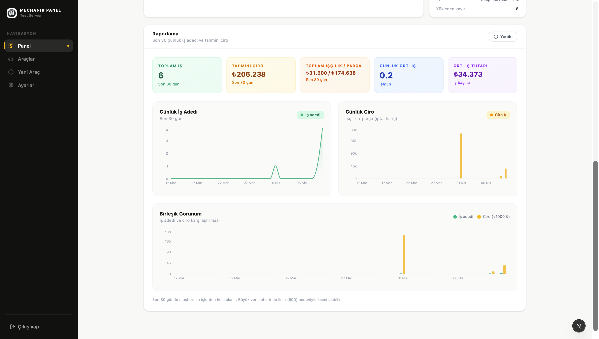

# 🚗 Vehicle Service Management System
A full-stack service management platform designed for automotive workshops to manage vehicles, service operations, and business performance in a structured and trackable way.
---
## 📌 Overview
This system is designed to digitize and streamline automotive workshop operations.
It provides a centralized structure for managing vehicles, service jobs, costs, and business performance metrics.
The main goal is to eliminate unstructured records and make service workflows fully traceable and measurable.
---
## ⚙️ Features
### 🏢 Business Management
- Create and manage a business account
- Join businesses via invitation code
- Role-based access control (Owner / Employee structure)
### 🚗 Vehicle Management
- Register vehicles with customer information
- Maintain structured vehicle history
- Track all service records per vehicle
### 🔧 Service Operations
- Create detailed service jobs (maintenance, repair, diagnostics)
- Predefined + custom service categories
- Mileage-based tracking for historical context
- Attach images for service documentation
- Full lifecycle tracking (Active → Completed)
### 💰 Cost Management
- Add parts, quantities, and unit prices per job
- Automatic total cost calculation
- Separate tracking of labor and parts expenses
- Transparent cost breakdown per service
### 📊 Analytics Dashboard
- Active job monitoring
- Completed job statistics
- Revenue tracking (total / labor / parts)
- KPI-based visual analytics
---
## 🧠 Problem It Solves
- Lack of structured service history in workshops
- Difficulty tracking past vehicle maintenance
- No transparency in job-level costing
- No centralized system for workshop operations and reporting
---
## 🛠️ Tech Stack
- Next.js
- React
- TypeScript
- Firebase (Auth, Firestore, Storage)
- Tailwind CSS
---
## 🚀 Getting Started
Install dependencies and run the development server:
```bash
npm install
npm run dev
```
Then open:
http://localhost:3000
---
## 📸 Screenshots
> All screenshots are located in `/public/screenshots`
### 📊 Dashboard


### 🆕 New Job Creation


### 🔧 Job Details


### 🚗 Vehicle Details


### 📈 Analytics

---
## 🤖 AI Usage
AI tools were used as a development assistant for productivity and debugging support.
However, architecture decisions, system design, and implementation logic were fully controlled and directed by the developer.
---
## 📌 Status
This project is currently under active development. New features and improvements are continuously being added.
---
## 📬 Feedback
Feedback, suggestions, and improvements are highly appreciated.
---
